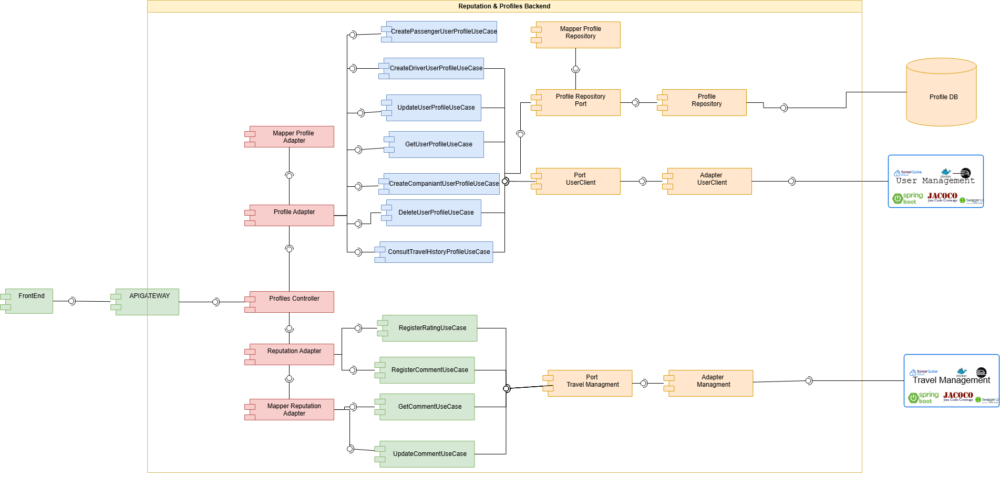
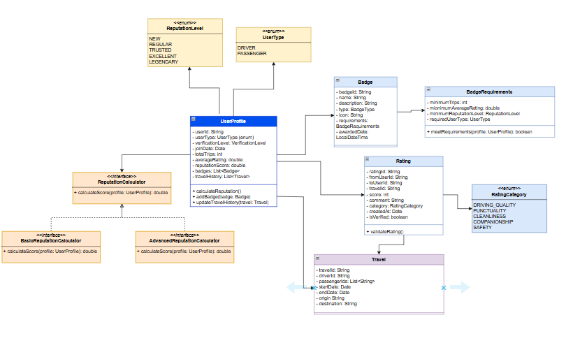
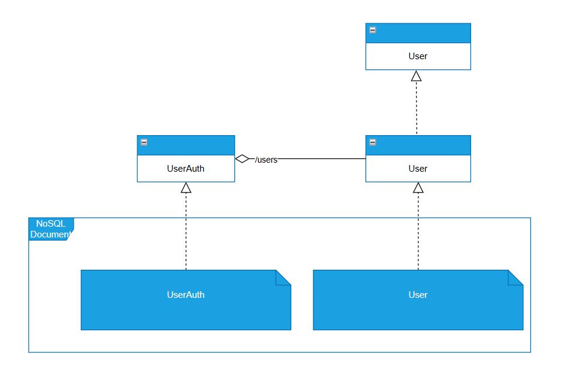
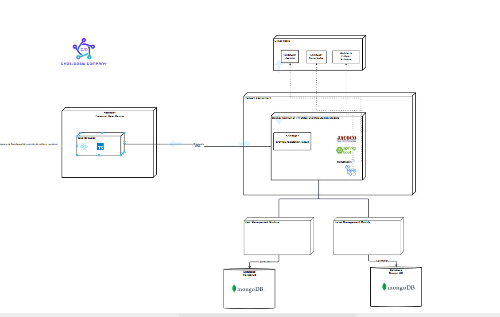
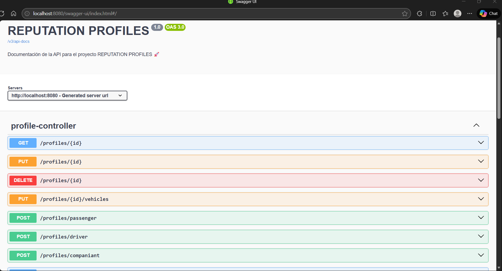
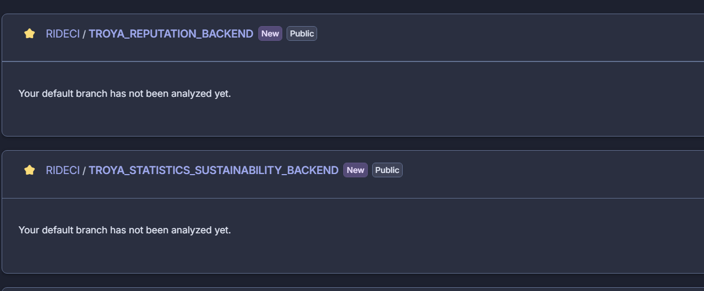
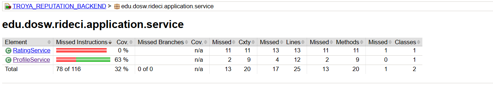
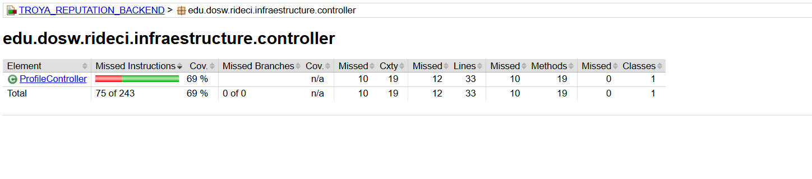

# TROYA_REPUTATION_BACKEND

## Desarrolladores

* Julian Camilo Lopez Barrero
* Julian David Castiblanco Real
* Valeria Bermudez Aguilar
* Sebastian Enrique Barros Barros
* Santiago Suarez Puchigay


---

## Descripcion del modulo 

El servicio tiene como objetivo principal gestionar la reputación y el perfil de cada usuario dentro de la comunidad RIDECI, fomentando la confianza y la transparencia entre conductores y pasajeros. 
A través de este módulo, los usuarios podrán otorgar y recibir calificaciones al finalizar cada viaje, registrar comentarios voluntarios y visualizar su promedio general de reputación. 
El sistema permitirá además la asignación automática de distintivos representativos, tales como “Conductor confiable” o “Pasajero frecuente”, basados en el historial de participación y las valoraciones obtenidas. 

El módulo integrará funcionalidades para que los administradores puedan supervisar y moderar los comentarios, revisar reportes asociados a comportamientos inadecuados y garantizar un entorno respetuoso dentro de la plataforma. 
Asimismo, se ofrecerá una vista consolidada del historial de viajes, puntuaciones y reportes resueltos, asegurando la trazabilidad y transparencia de la información relacionada con cada usuario. 

## Tabla de Contenidos

* [ Estrategia de Versionamiento y Branching](#-estrategia-de-versionamiento-y-branching)

    * [ Estrategia de Ramas (Git Flow)](#-estrategia-de-ramas-git-flow)
    * [ Convenciones de Nomenclatura](#-convenciones-de-nomenclatura)
    * [ Convenciones de Commits](#-convenciones-de-commits)
* [ Arquitectura del Proyecto](#-arquitectura-del-proyecto)

    * [ Estructura de Capas](#️-estructura-de-capas)
* [ Tecnologías Utilizadas](#️-tecnologías-utilizadas)
* [ Arquitectura Limpia - Organización de Capas](#️-arquitectura-limpia---organización-de-capas)
* [Diagramas del Módulo](#diagramas-del-módulo)


---

##  Estrategia de versionamiento y Branching

Se implementa una estrategia de versionamiento basada en **GitFlow**, garantizando un flujo de desarrollo **colaborativo, trazable y controlado**.

###  Beneficios:

- Permite trabajo paralelo sin conflictos
- Mantiene versiones estables y controladas
- Facilita correcciones urgentes (*hotfixes*)
- Proporciona un historial limpio y entendible

---

##  🧭 Estrategia de Versionamiento y Branching
Se aplica GitFlow, garantizando:
-  Desarrollo organizado
-  Flujo escalable
-  Versiones estables
-  Hotfixes rápidos
-  Integración continua limpia

| **Rama**                | **Propósito**                            | **Recibe de**           | **Envía a**        | **Notas**                      |
| ----------------------- | ---------------------------------------- | ----------------------- | ------------------ | ------------------------------ |
| `main`                  | Código estable para PREPROD o Producción | `release/*`, `hotfix/*` | Despliegue         | Protegida con PR y CI exitoso  |
| `develop`               | Rama principal de desarrollo             | `feature/*`             | `release/*`        | Base para integración continua |
| `feature/*`             | Nuevas funcionalidades o refactors       | `develop`               | `develop`          | Se eliminan tras el merge      |
| `release/*`             | Preparación de versiones estables        | `develop`               | `main` y `develop` | Incluye pruebas finales        |
| `bugfix/*` o `hotfix/*` | Corrección de errores críticos           | `main`                  | `main` y `develop` | Parches urgentes               |

---

##  🏷️ Convenciones de Nomenclatura

### Feature Branches

```
feature/[nombre-funcionalidad]-Troya_[codigo-jira]
```

**Ejemplos:**

```
- feature/statitics-module-troya_23
- feature/userProfile-service-troya_41
```

**Reglas:**

*  Formato: *kebab-case*
*  Incluir código Jira
*  Descripción breve y clara
*  Longitud máxima: 50 caracteres

---

### Release Branches

```
release/[version]
```

**Ejemplos:**

```
- release/1.0.0
- release/1.1.0-beta
```

---

### Hotfix Branches

```
hotfix/[descripcion-breve-del-fix]
```

**Ejemplos:**

```
- hotfix/fix-token-expiration
- hotfix/security-patch
```

---

## Convenciones de Commits

```
[tipo]: [descripción breve]
```
*Ejemplos*
```
feat: agregar grafico de sostenibilidad
fix: corregir error en estadistica por consumo Co2
```
### Formato Estándar

```
[codigo-jira] [tipo]: [descripción breve de la acción]
```

**Ejemplos:**

```
feat: agregar grafico de sostenibilidad
fix: corregir error en estadistica por consumo Co2
```

---

### Tipos de Commit

| **Tipo**   | **Descripción**                      | **Ejemplo**                                     |
| ----------- | ------------------------------------ | ----------------------------------------------- |
| `feat`      | Nueva funcionalidad                  | `22-feat: implementar autenticación con JWT`    |
| `fix`       | Corrección de errores                | `24-fix: solucionar error en endpoint de estadisticas` |
| `docs`      | Cambios en documentación             | `25-docs: actualizar README con nuevas rutas`   |
| `refactor`  | Refactorización sin cambio funcional | `27-refactor: optimizar servicio de sosteniblidad`  |
| `test`      | Pruebas unitarias o de integración   | `29-test: agregar tests para statistics service`       |
| `chore`     | Mantenimiento o configuración        | `30-chore: actualizar dependencias de Maven`    |


**Reglas:**

* Un commit = una acción completa
* Máximo **72 caracteres** por línea
* Usar modo imperativo (“agregar”, “corregir”, etc.)
* Descripción clara de qué y dónde
* Commits pequeños y frecuentes

---

## Arquitectura del Proyecto

El backend de **TROYA_STATISTICS_SUSTAINABILITY** sigue una **arquitectura limpia y desacoplada**, priorizando:

* Separación de responsabilidades
* Mantenibilidad
* Escalabilidad
* Facilidad de pruebas

---

## Estructura de Capas

```
📂 TROYA_REPUTATION_BACKEND
 ┃
 ┣ 📂 application/
 ┃  ┣ 📂 events/
 ┃  ┃  ┣ 📂 listener/
 ┃  ┃  ┣ 📄 Event
 ┃  ┣ 📂 mapper/
 ┃  ┣ 📂 port/
 ┃  ┃  ┣ 📂 in/
 ┃  ┃  ┣ 📂 out/
 ┃  ┣ 📂 service/
 ┃
 ┣ 📂 domain/
 ┃  ┣ 📂 model/
 ┃     ┣ 📂 enums/
 ┃     ┣ 📄 Modelo De Negocio
 ┃
 ┣ 📂 infrastructure/
 ┃  ┣ 📂 config/
 ┃  ┣ 📂 controller/
 ┃  ┃  ┣ 📂 dto/
 ┃  ┃   ┃  ┣ 📂 request/
 ┃  ┃   ┃  ┣ 📂 response/
 ┃  ┃   ┣ 📄 Controller
 ┃  ┃
 ┃  ┣ 📂 persistence/
 ┃     ┣ 📂 entity/
 ┃     ┣ 📂 repository/
 ┃        ┣ 📂 mapper/
 ┃
 ┗ 📄 pom.xml
```
---

## Tecnologías Utilizadas

| **Categoría**              | **Tecnologías**                           |
| -------------------------- | ----------------------------------------- |
| **Backend**                | Java 17, Spring Boot, Maven               |
| **Infraestructura**        | Docker, Kubernetes (K8s), Railway, Vercel |
| **Seguridad**              | JWT, Spring Security                      |
| **Integración Continua**   | GitHub Actions, Jacoco, SonarQube         |
| **Documentación y Diseño** | Swagger UI, Figma                         |
| **Comunicación y Gestión** | Slack, Jira                               |
| **Testing**                | Postman                                   |

---

## Arquitectura Limpia - Organización de Capas

### DOMAIN (Dominio)

Representa el **núcleo del negocio**, define **qué hace el sistema, no cómo lo hace**.
Incluye entidades, objetos de valor, enumeraciones, interfaces de repositorio y servicios de negocio.

### APPLICATION (Aplicación)

Orquesta la lógica del negocio a través de **casos de uso**, **DTOs**, **mappers** y **excepciones personalizadas**.

### INFRASTRUCTURE (Infraestructura)

Implementa los **detalles técnicos**: controladores REST, persistencia, configuración, seguridad y conexión con servicios externos.

---

## 📡 Documentación de Endpoints

El módulo expone los siguientes endpoints REST a través del `ProfileController` (ruta base: `/profiles`) para gestionar el ciclo de vida de los perfiles y su reputación.

### 👤 Gestión de Perfiles (Profile)

| Método | Endpoint | Descripción |
| :--- | :--- | :--- |
| `POST` | `/driver` | Crea un nuevo perfil de tipo **Conductor**. |
| `POST` | `/companiant` | Crea un nuevo perfil de tipo **Acompañante**. |
| `POST` | `/passenger` | Crea un nuevo perfil de tipo **Pasajero**. |
| `GET` | `/{id}` | Obtiene la información detallada de un perfil por su ID. |
| `GET` | `/allProfiles` | Obtiene el listado de todos los perfiles registrados. |
| `PUT` | `/{id}` | Actualiza la información básica de un perfil existente. |
| `PUT` | `/{id}/vehicles` | Actualiza la lista de vehículos asociados a un perfil. |
| `DELETE` | `/{id}` | Elimina un perfil del sistema por su ID. |

### ⭐ Reputación y Comentarios

| Método | Endpoint | Descripción |
| :--- | :--- | :--- |
| `GET` | `/{id}/reputation/average` | Calcula y retorna el promedio de reputación de un usuario. |
| `GET` | `/{id}/reputation/history` | Obtiene el historial completo de calificaciones recibidas. |
| `GET` | `/ratings/{ratingId}` | Consulta una calificación específica por su ID. |
| `GET` | `/{id}/comments` | Lista todos los comentarios (texto) asociados a un perfil. |
| `GET` | `/{id}/comments/detail` | Obtiene el detalle completo (DTO) de los comentarios de un perfil. |
| `GET` | `/comments/{commentId}` | Consulta un comentario específico por su ID. |
| `DELETE` | `/comments/{commentId}` | Elimina un comentario específico (Funcionalidad Admin). |
| `DELETE` | `/{id}/comments` | Elimina **todos** los comentarios de un perfil (Funcionalidad Admin). |
| `GET` | `/trip/{tripId}/ratings` | Obtiene todas las calificaciones asociadas a un viaje específico. |

### 🏅 Insignias (Badges)

| Método | Endpoint | Descripción |
| :--- | :--- | :--- |
| `GET` | `/{id}/badges` | Obtiene las insignias ganadas por un usuario. |
| `POST` | `/{id}/badges/calculate` | **Trigger manual:** Ejecuta el motor de reglas para calcular y asignar insignias nuevas a un usuario. |

---

## 📝 Ejemplos de Uso (JSON)

A continuación se muestran ejemplos de los cuerpos de petición y respuesta para los endpoints principales.

### 1. Crear Perfil de Conductor
**POST** `/profiles/driver`

**Request Body:**
```
json
{
  "name": "Carlos Rodriguez",
  "email": "carlos.rodriguez@example.com",
  "phoneNumber": "+573001234567",
  "vehicles": [
    {
      "plate": "ABC-123",
      "model": "Renault Logan",
      "color": "Gris",
      "year": "2022"
    }
  ]
}
```

**Response Body:**
```
json
{
  "id": 1,
  "name": "Carlos Rodriguez",
  "profileType": "DRIVER",
  "calification": {
    "average": 0.0,
    "totalRatings": 0
  },
  "badges": [],
  "vehicles": [
    {
      "plate": "ABC-123",
      "model": "Renault Logan"
    }
  ]
}
```

**Response Body:**


## Diagramas del Módulo

### Diagrama de Componentes Específico




---

### Diagrama de Clases



---

### Diagrama de Bases de Datos



---

### Diagrama de Despliegue Específico del Módulo



---
### Evidencia Swagger



---

### Evidencia SonarQube



---

### Evidencia Jacoco


---



--- 


## Instalación

### Prerrequisitos

- Java 17
- Maven
- MongoDB
- Git

### Clonar el repositorio

```bash
git clone https://github.com/RIDECI/TROYA_REPUTATION_BACKEND.git
cd TROYA_REPUTATION_BACKEND
```

### Instalar dependencias

```bash
mvn clean install
```

---

## Uso

```bash
mvn clean install
```
Para ejecutar el proyecto:

```bash
mvn spring-boot:run
```
Ó:

```bash
docker compose up -d
```

**RIDECI** - Conectando a la comunidad para moverse de forma segura, económica y sostenible.
