# 🐴 Troya - Profiles & Reputation Backend

The service's main objective is to manage the reputation and profile of each user within the RIDECI community, fostering trust and transparency between drivers and passengers. Through this module, users can give and receive ratings at the end of each trip, post voluntary comments, and view their overall reputation average. The system will also allow for the automatic assignment of representative badges, such as "Trusted Driver" or "Frequent Passenger," based on participation history and ratings received.

The module will integrate functionalities so that administrators can monitor and moderate comments, review reports related to inappropriate behavior, and ensure a respectful environment on the platform. It will also offer a consolidated view of trip history, ratings, and resolved reports, ensuring the traceability and transparency of information related to each user.

## 👥 Developers

- Julian Camilo Lopez Barrero
- Julian David Castiblanco Real
- Valeria Bermudez Aguilar
- Sebastian Enrique Barros Barros
- Santiago Suarez Puchigay


## 📑 Content Table

1. [Project Architecture](#-project-architecture)
    - [Hexagonal Structure](#-clean---hexagonal-structure)
2. [API Documentation](#-api-endpoints)
    - [Endpoints](#-api-endpoints)
3. [Input & Output Data](#input-and-output-data)
4. [Microservices Integration](#-connections-with-other-microservices)
5. [Technologies](#technologies)
6. [Branch Strategy](#-branches-strategy--structure)
7. [System Architecture & Design](#-system-architecture--design) 
8. [Getting Started](#-getting-started) 
9. [Testing](#-testing)

---
## 🏛️ Project Architecture

The Troya Reputation & Profiles have a unacoplated hexagonal - clean architecture where looks for isolate the business logic with the other part of the app dividing it in multiple components:

* **🧠 Domain (Core)**: Contains the business logic and principal rules.

* **🎯 Ports (Interfaces)**: Are interfaces that define the actions that the domain can do.

* **🔌 Adapters (Infrastructure)**: Are the implementations of the ports that connect the domain with the specific technologies. 

The use of this architecture has the following benefits:

* ✅ **Separation of Concerns:** Distinct boundaries between logic and infrastructure.
* ✅ **Maintainability:** Easier to update or replace specific components.
* ✅ **Scalability:** Components can evolve independently.
* ✅ **Testability:** The domain can be tested in isolation without a database or server.

## 📂 Clean - Hexagonal Structure

```
📂 TROYA_REPUTATION_BACKEND
 ┣ 📂 src/
 ┃ ┣ 📂 main/
 ┃ ┃ ┣ 📂 java/
 ┃ ┃ ┃ ┗ 📂 edu/dosw/rideci/
 ┃ ┃ ┃   ┣ 📄 TroyaReputationBackendApplication.java
 ┃ ┃ ┃   ┣ 📂 domain/
 ┃ ┃ ┃   ┃ ┗ 📂 model/            # 🧠 Domain models
 ┃ ┃ ┃   ┣ 📂 application/
 ┃ ┃ ┃   ┃ ┣ 📂 ports/
 ┃ ┃ ┃   ┃ ┃ ┣ 📂 input/          # 🎯 Input ports (Exposed use cases)
 ┃ ┃ ┃   ┃ ┃ ┗ 📂 output/         # 🔌 Output ports (external gateways)
 ┃ ┃ ┃   ┃ ┗ 📂 usecases/         # ⚙️ Use case implementations
 ┃ ┃ ┃   ┣ 📂 infrastructure/
 ┃ ┃ ┃   ┃ ┗ 📂 adapters/
 ┃ ┃ ┃   ┃   ┣ 📂 input/
 ┃ ┃ ┃   ┃   ┃ ┗ 📂 controller/   # 🌐 Input adapters (REST controllers)
 ┃ ┃ ┃   ┃   ┗ 📂 output/
 ┃ ┃ ┃   ┃     ┗ 📂 persistence/  # 🗄️ Output adapters (persistance)
 ┃ ┃ ┗ 📂 resources/
 ┃ ┃   ┗ 📄 application.properties
 ┣ 📂 test/
 ┃ ┣ 📂 java/
 ┃ ┃ ┗ 📂 edu/dosw/rideci/
 ┃ ┃   ┗ 📂 tests/
 ┣ 📂 docs/
    ┣ 📂 img/
      ┣ diagramaClases.jpg
      ┣ diagramaDatos.jpg
      ┃ diagramaDespliegue.png
 ┣ 📄 pom.xml
 ┣ 📄 mvnw / mvnw.cmd
 ┗ 📄 README.md
```
# Technologies

The following technologies were used to build and deploy this module:

### Backend & Core


### Database


### DevOps & Infrastructure


### CI/CD & Quality Assurance


### Documentation & Testing


### Design 


### Comunication & Project Management


---

# 📡 API Endpoints

For detailed documentation refer to our Swagger UI (Running locally at http://localhost:8080/swagger-ui.html).

### 👤 Profile


| Método | Endpoint | Descripción |
| :--- | :--- | :--- |
| `POST` | `/driver` | Crea un nuevo perfil de tipo **Conductor**. |
| `POST` | `/companiant` | Crea un nuevo perfil de tipo **Acompañante**. |
| `POST` | `/passenger` | Crea un nuevo perfil de tipo **Pasajero**. |
| `GET` | `/{id}` | Obtiene la información detallada de un perfil por su ID. |
| `GET` | `/allProfiles` | Obtiene el listado de todos los perfiles registrados. |
| `PUT` | `/{id}` | Actualiza la información básica de un perfil existente. |
| `PUT` | `/{id}/vehicles` | Actualiza la lista de vehículos asociados a un perfil. |
| `DELETE` | `/{id}` | Elimina un perfil del sistema por su ID. |

### ⭐ Reputation and Comments

| Método | Endpoint | Descripción |
| :--- | :--- | :--- |
| `GET` | `/{id}/reputation/average` | Calcula y retorna el promedio de reputación de un usuario. |
| `GET` | `/{id}/reputation/history` | Obtiene el historial completo de calificaciones recibidas. |
| `GET` | `/ratings/{ratingId}` | Consulta una calificación específica por su ID. |
| `GET` | `/{id}/comments` | Lista todos los comentarios (texto) asociados a un perfil. |
| `GET` | `/{id}/comments/detail` | Obtiene el detalle completo (DTO) de los comentarios de un perfil. |
| `GET` | `/comments/{commentId}` | Consulta un comentario específico por su ID. |
| `DELETE` | `/comments/{commentId}` | Elimina un comentario específico (Funcionalidad Admin). |
| `DELETE` | `/{id}/comments` | Elimina **todos** los comentarios de un perfil (Funcionalidad Admin). |
| `GET` | `/trip/{tripId}/ratings` | Obtiene todas las calificaciones asociadas a un viaje específico. |

### 🏅 Badges

| Método | Endpoint | Descripción |
| :--- | :--- | :--- |
| `GET` | `/{id}/badges` | Obtiene las insignias ganadas por un usuario. |
| `POST` | `/{id}/badges/calculate` | **Trigger manual:** Ejecuta el motor de reglas para calcular y asignar insignias nuevas a un usuario. |

---

### 📟 HTTP Status Codes
Common status codes returned by the API.

| Code | Status | Description |
| :--- | :--- | :--- |
| `200` | **OK** | Request processed successfully. |
| `201` | **Created** | Resource (Route/Tracking) created successfully. |
| `400` | **Bad Request** | Invalid coordinates or missing parameters. |
| `401` | **Unauthorized** | Missing or invalid JWT token. |
| `404` | **Not Found** | Route or Trip ID does not exist. |
| `500` | **Internal Server Error** | Unexpected error (e.g., Google Maps API failure).

# Input and Output Data

### 1. Create Profile

**POST** `/profiles/driver`

**Request Body:**
```
json
{
  "name": "Carlos Rodriguez",
  "email": "carlos.rodriguez@example.com",
  "phoneNumber": "+573001234567",
  "vehicles": [
    {
      "plate": "ABC-123",
      "model": "Renault Logan",
      "color": "Gris",
      "year": "2022"
    }
  ]
}
```

**Response Body:**
```
json
{
  "id": 1,
  "name": "Carlos Rodriguez",
  "profileType": "DRIVER",
  "calification": {
    "average": 0.0,
    "totalRatings": 0
  },
  "badges": [],
  "vehicles": [
    {
      "plate": "ABC-123",
      "model": "Renault Logan"
    }
  ]
}
```

**POST** `/profiles/companiant`

**Request Body:**
```
json
{
  "name": "Roberto Acuña",
  "email": "Roberto.Acuña@example.com",
  "phoneNumber": "+573001234567",
  "vehicles": []
}
```

**Response Body:**
```
json
{
  "id": 2,
  "name": "Roberto Acuña",
  "profileType": "COMPANION",
  "calification": {
    "average": 0.0,
    "totalRatings": 0
  },
  "badges": [],
  "vehicles": []
}
```

**POST** `/profiles/passenger`

**Request Body:**
```
json
{
  "name": "Roberto Acuña",
  "email": "Roberto.Acuña@example.com",
  "phoneNumber": "+573001234567",
  "vehicles": []
}
```

**Response Body:**
```
json
{
  "id": 3,
  "name": "Roberto Acuña",
  "profileType": "PASSENGER",
  "calification": {
    "average": 0.0,
    "totalRatings": 0
  },
  "badges": [],
  "vehicles": []
}
```


### 2. Get Profile By Id

**GET** `/profiles/{id}`

**Path Parameter:**
```
Long
{1}
```

**Response Body:**
```
json
{
  "id": 1,
  "name": "Carlos Rodriguez",
  "profileType": "DRIVER",
  "calification": {
    "average": 0.0,
    "totalRatings": 0
  },
  "badges": [],
  "vehicles": [
    {
      "plate": "ABC-123",
      "model": "Renault Logan"
    }
  ]
}
```

### 3. Get All Profiles

**GET** `/profiles/allProfiles`

**Request Body:**
``` 
Void

No request body
```


**Response Body:**
```
json
[
    {
      "id": 1,
      "name": "Carlos Rodriguez",
      "profileType": "DRIVER",
      "calification": {
        "average": 0.0,
        "totalRatings": 0
      },
      "badges": [],
      "vehicles": [
        {
          "plate": "ABC-123",
          "model": "Renault Logan"
        }
      ]
    },
    {
      "id": 3,
      "name": "Roberto Acuña",
      "profileType": "PASSENGER",
      "calification": {
        "average": 0.0,
        "totalRatings": 0
      },
      "badges": [],
      "vehicles": []
    }    
]
```

### 4. Update Profile 

**PUT** `/profiles/{id}`

**Path Parameter:**
```
Long 

{1}
```
**Request Body:**
``` 
json
{
  "name": "Carlos Enrique Rodriguez",
  "email": "carlos.rodriguez@exampleHotmail.com",
  "phoneNumber": "+573001234567",
  "vehicles": [
    {
      "plate": "ABC-123",
      "model": "Renault Logan",
      "color": "Gris",
      "year": "2022"
    }
  ]
}
```

**Response Body:**
```
json
{
  "id": 1,
  "name": "Carlos Enrique Rodriguez",
  "profileType": "DRIVER",
  "calification": {
    "average": 0.0,
    "totalRatings": 0
  },
  "badges": [],
  "vehicles": [
    {
      "plate": "ABC-123",
      "model": "Renault Logan"
    }   
  ]
}
```


### 5. Update Profile Vehicles

**PUT** `/profiles/{id}/vehicles`

**Path Parameter:**
```
Long

{1}
```
**Request Body:**
``` 
json
{
  "name": "Carlos Rodriguez",
  "email": "carlos.rodriguez@example.com",
  "phoneNumber": "+573001234567",
  "vehicles": [
    {
      "plate": "ABC-123",
      "model": "Renault Logan",
      "color": "Gris",
      "year": "2022"
    },
    {
      "plate": "XYZ-789",
      "model": "Toyota Corolla",
      "color": "Azul",
      "year": "1022"
    }
  ]
}
```

**Response Body:**
```
json
{
  "id": 1,
  "name": "Carlos Rodriguez",
  "profileType": "DRIVER",
  "calification": {
    "average": 0.0,
    "totalRatings": 0
  },
  "badges": [],
  "vehicles": [
    {
      "plate": "ABC-123",
      "model": "Renault Logan"
    },
    {
      "plate": "XYZ-789",
      "model": "Toyota Corolla"
    }    
  ]
}
```

### 6. Delete Profile 

**Delete** `/profiles/{id}`

**Path Parameter:**
```
Long 

{1}
```

**Response Body:**
```
No Response Body (204 No Content)
```


### 7. Get Profile Average Reputation 

**GET** `/profiles/{id}/reputation/average"`

**Path Parameter:**
```
Long

{1}
```

**Response Body:**
```
Double
0.0
```

### 8. Get Profile Reputation History 

**GET** `/profiles/{id}/reputation/history"`

**Path Parameter:**
```
Long

{1}
```

**Response Body:**
```
json
[
  {
    "id": 101,
    "tripId": 45,
    "raterId": 2,
    "targetId": 1,
    "score": 5,
    "date": "2025-11-01T14:30:00",
    "comment": "Excelente conductor, muy puntual."
  },
  {
    "id": 102,
    "tripId": 48,
    "raterId": 3,
    "targetId": 1,
    "score": 4,
    "date": "2025-11-10T10:15:00",
    "comment": "Conductor amable y responsable."
  }
]
```

### 9. Get Rating By Id

**GET** `/profiles/ratings/{ratingId}"`

**Path Parameter:**
```
Long

{101}
```

**Response Body:**
```
json
{
  "id": 101,
  "tripId": 45,
  "raterId": 2,
  "targetId": 1,
  "score": 5,
  "date": "2025-11-01T14:30:00",
  "comment": "Excelente conductor, muy puntual."
}
```

### 10. List All Profile Comments

**GET** `/profiles/{id}/comments"`

**Path Parameter:**
```
Long

{1}
```

**Response Body:**
```
json
[
  "Excelente conductor, muy puntual.",
  "Amable y respetuoso durante el viaje.",
  "El vehículo estaba limpio y comodo."
]
```

### 11. Get Profile Comments

**GET** `/profiles/{id}/comments/detail""`

**Path Parameter:**
```
Long

{1}
```

**Response Body:**
```
json
[
  {
    "id": 101,
    "tripId": 55,
    "raterId": 2,
    "targetId": 1,
    "score": 5,
    "date": "2025-11-01T14:30:00",
    "comment": "Excelente conductor, muy puntual."
  },
  {
    "id": 102,
    "tripId": 57,
    "raterId": 3,
    "targetId": 1,
    "score": 4,
    "date": "2025-11-10T09:15:00",
    "comment": "Amable y respetuoso durante el viaje."
  }
]
```

### 12. List All Profile Comments

**GET** `/profiles/comments/{commentId}"`

**Path Parameter:**
```
Long

{102}
```

**Response Body:**
```
json
{
   "id": 102,
   "tripId": 57,
   "raterId": 3,
   "targetId": 1,
   "score": 4,
   "date": "2025-11-10T09:15:00",
   "comment": "Amable y respetuoso durante el viaje."
}
```

### 13. Delete a Comment

**DELETE** `/profiles/comments/{commentId}"`

**Path Parameter:**
```
Long

{102}
```

**Response Body:**
```
No Response Body (204 No Content)
```

### 14. Delete All Comments From a profile

**DELETE** `/profiles/{id}/comments"`

**Path Parameter:**
```
Long

{102}
```

**Response Body:**
```
No Response Body (204 No Content)
```

### 15. Get Profile Badges

**GET** `/profiles/{id}/badges"`

**Path Parameter:**
```
Long

{102}
```

**Response Body:**
```
[
  {
    "name": "PUNTUAL",
    "pathImageBlackAndWhite": "/images/badges/punctual_bw.png",
    "pathImageColor": "/images/badges/punctual_color.png",
    "description": "Siempre llega a tiempo a sus viajes",
    "isActive": true
  },
  {
    "name": "RESPONSABLE",
    "pathImageBlackAndWhite": "/images/badges/responsible_bw.png",
    "pathImageColor": "/images/badges/responsible_color.png",
    "description": "Se comporta de manera responsable y segura",
    "isActive": false
  }
]
```

### 16. Get Trip  Ratings

**GET** `/profiles/trip/{tripId}/ratings"`

**Path Parameter:**
```
Long

{45}
```

**Response Body:**
```
[
  {
    "id": 201,
    "tripId": 45,
    "raterId": 2,
    "targetId": 1,
    "score": 5,
    "date": "2025-11-01T14:30:00",
    "comment": "Muy buen viaje, puntual y seguro."
  },
  {
    "id": 202,
    "tripId": 45,
    "raterId": 3,
    "targetId": 1,
    "score": 4,
    "date": "2025-11-01T14:35:00",
    "comment": "Conductor amable y responsable."
  }
]
```

### 17. Assign Badges to Profile

**POST** `/profiles/{id}/badges/calculate"`

**Path Parameter:**
```
Long

{1}
```

**Response Body:**
```
{
  "id": 1,
  "name": "Carlos Rodriguez",
  "profileType": "DRIVER",
  "calification": {
    "average": 4.8,
    "totalRatings": 12
  },
  "badges": [
    {
      "name": "PUNTUAL",
      "pathImageBlackAndWhite": "/images/badges/punctual_bw.png",
      "pathImageColor": "/images/badges/punctual_color.png",
      "description": "Siempre llega a tiempo a sus viajes",
      "isActive": true
    },
    {
      "name": "RESPONSABLE",
      "pathImageBlackAndWhite": "/images/badges/responsible_bw.png",
      "pathImageColor": "/images/badges/responsible_color.png",
      "description": "Se comporta de manera responsable y segura",
      "isActive": true
    }
  ],
  "vehicles": [
    {
      "plate": "ABC-123",
      "model": "Renault Logan"
    }
  ]
}
```

# 🔗 Connections with other Microservices

This module does not work alone. It interacts with the RideCi Ecosystem via REST APIs and Message Brokers:

1. Travel Management Module: Receives information about the travel.
2. Reserch , Payments and Reservations: Receives the state pf the travel if that was paid and ended


# 🌿 Branches Strategy & Structure

This module follows a strict branching strategy based on Gitflow to ensure the ordered versioning,code quality and continous integration.


| **Branch**                | **Purpose**                            | **Receive of**           | **Sent to**        | **Notes**                      |
| ----------------------- | ---------------------------------------- | ----------------------- | ------------------ | ------------------------------ |
| `main`                  | 🏁 Stable code for preproduction or Production | `release/*`, `hotfix/*` | 🚀 Production      | 🔐 Protected with PR y successful CI   |
| `develop`               | 🧪 Main developing branch             | `feature/*`             | `release/*`        | 🔄 Base to continous deployment |
| `feature/*`             | ✨ New functions or refactors  to be implemented       | `develop`               | `develop`          | 🧹 Are deleted after merge to develop      |
| `release/*`             | 📦 Release preparation & final polish.      | `develop`               | `main` y `develop` | 🧪  Includes final QA. No new features added here.     |
| `bugfix/*` o `hotfix/*` | 🛠️ Critical fixes for production         | `main`                  | `main` y `develop` | ⚡ Urgent patches. Highest priority             |


# 🏷️ Naming Conventions

## 🌿 Branch Naming

### ✨ Feature Branches
Used for new features or non-critical improvements.

**Format:**
`feature/[shortDescription]`

**Examples:**
- `feature/authenticationModule`
- `feature/securityService`

**Rules:**
* 🧩 **Case:** strictly *camelCase* (lowercase with hyphens).
* ✍️ **Descriptive:** Short and meaningful description.
---

### 📦 Release Branches
Used for preparing a new production release. Follows [Semantic Versioning](https://semver.org/).

**Format:**
`release/v[major].[minor].[patch]`

**Examples:**
- `release/v1.0.0`
- `release/v1.1.0-beta`

---

### 🚑 Hotfix Branches
Used for urgent fixes in the production environment.

**Format:**
`hotfix/[shortDescription]`

**Examples:**
- `hotfix/fixTokenExpiration`
- `hotfix/securityPatch`

---

## 📝 Commit Message Guidelines

We follow the **[Conventional Commits](https://www.conventionalcommits.org/)** specification.

### 🧱 Standard Format

```text
<type>(<scope>): <short description>
```

# 📐 System Architecture & Design

This section provides a visual representation of the module's architecture ilustrating the base diagrams to show the application structure and components flow.


### 🧩 Context Diagram
---
This context diagram shows the RIDECI system and its interactions with four main external actors: Companionant, Admin, Passenger, and Driver. Each actor represents a different type of user who interacts with RIDECI in specific ways.

The Companionant can create a new profile with their corresponding role.

The Admin is responsible for maintaining the application and moderating comments.

The Passenger can rate the user who provides the service and leave comments.

The Driver can review the trips they have completed and view their ratings.

The core system, RIDECI, focuses on Profiles and Reputation. It supports functionalities such as creating, updating, retrieving, and deleting user profiles, viewing travel history, checking average number of trips, registering ratings and comments, calculating user reputation, moderating feedback, and displaying user badges.


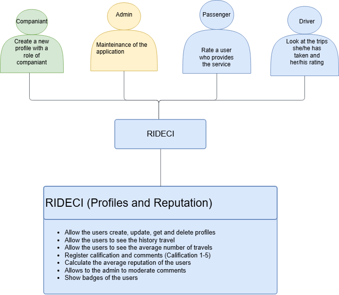

### 🧩 Specific Components Diagram
---
This diagram visualizes the dependencies between classes for developing the module's logic. It includes the following components:

* Controllers:
    * Reputation Controller: This controller receives and manages all requests related to profiles and reputation management, including references handled via DTOs.

When applying a hexagonal architecture, before developing the use cases, we need adapter components:

* Adapter:

    * Profile Adapter: Contracts (interfaces) are defined based on the input received from the controllers.

    * Mapper Profile Adapter: This adapter transforms data types from one object to another for use in the respective use cases.

* Use Cases:

    * Create Passenger Use Case: Implementation to create a profile with role Passenger

    * Create Driver Use Case: Implementation to create a profile with role Driver

    * Create Companion Use CaseCase: Implementation to create a profile with role Passenger

    * Update Profile Use CaseCase: Implementation to update a profile 

    * Delete Profile Use CaseCase: Implementation to delete a profile 

    * Get Profile Use CaseCase: Implementation to consult a profile 

    * Consult Travel History Use CaseCase: Implementation to consult the travel history of a profile 

    * Register Reputation Use CaseCase: Implementation to assign and register a calification of a profile

    * Get Reputation Use CaseCase: Implementation to consult and register a calification of a profile


* Ports: The following interfaces were defined as the data we will receive from the outside:

    * Port User Client

    * Port Profiles

    * Port Travel Managment 


### 🧩 Use Cases Diagram
---
This diagram presents the main functionalities defined by each actor. This facilitates a better understanding when implementing the module's multiple functions, as well as identifying and separating each actor's roles when using the application.

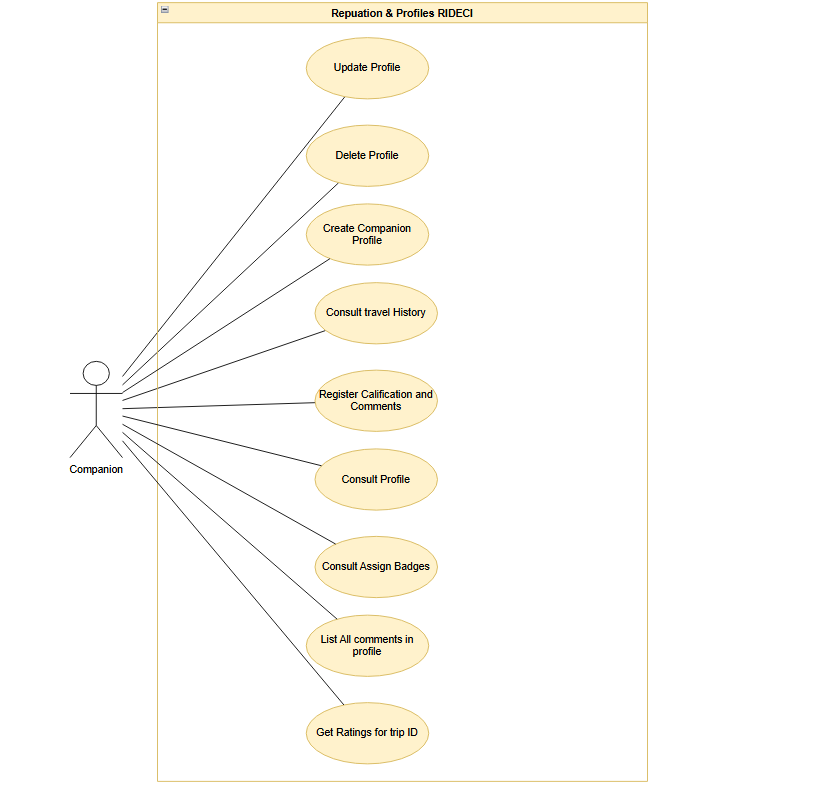
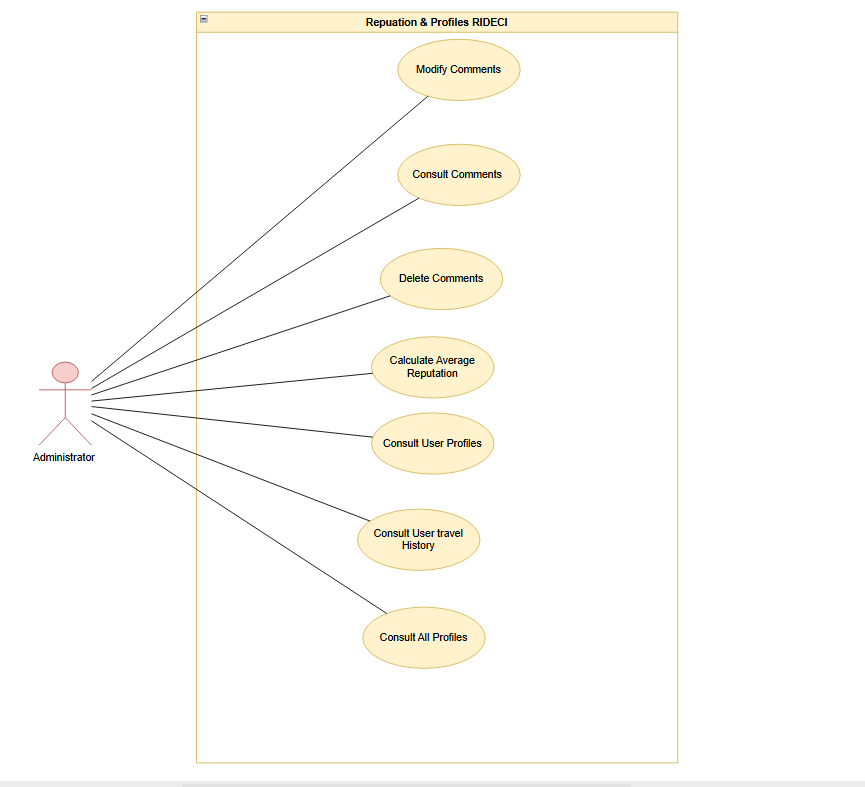
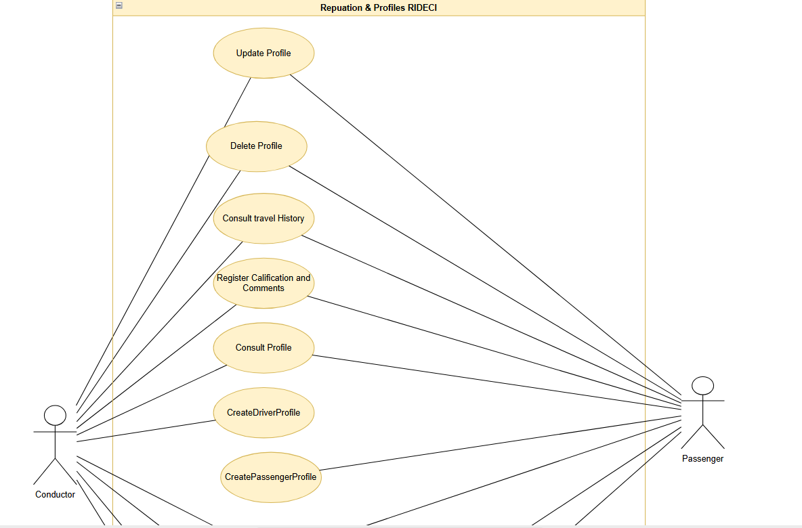
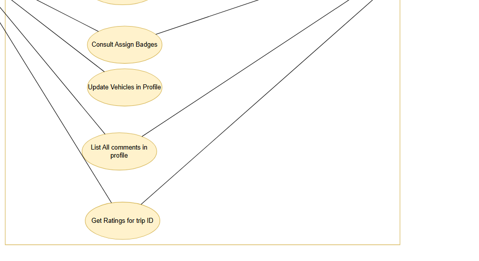


### 🧩 Class Diagram
---
Based on the Specific Components diagram, we created the class diagram, where we defined an Builder design pattern that will create the profile based on his role and we defined an Strategy Design Pattern to assign Badges to the profile

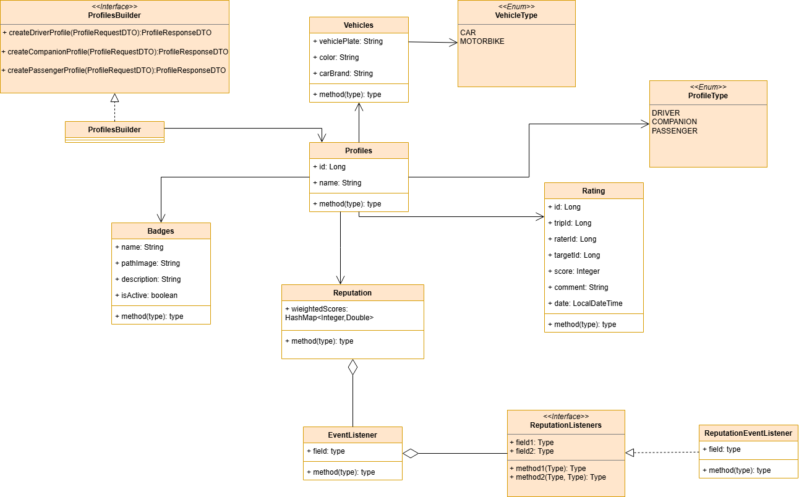


### 🧩 Data Base Diagram
---

This diagram represents how the data is stored, where we will find the multiple documents, and the data that will be stored in an embedded or referenced manner.

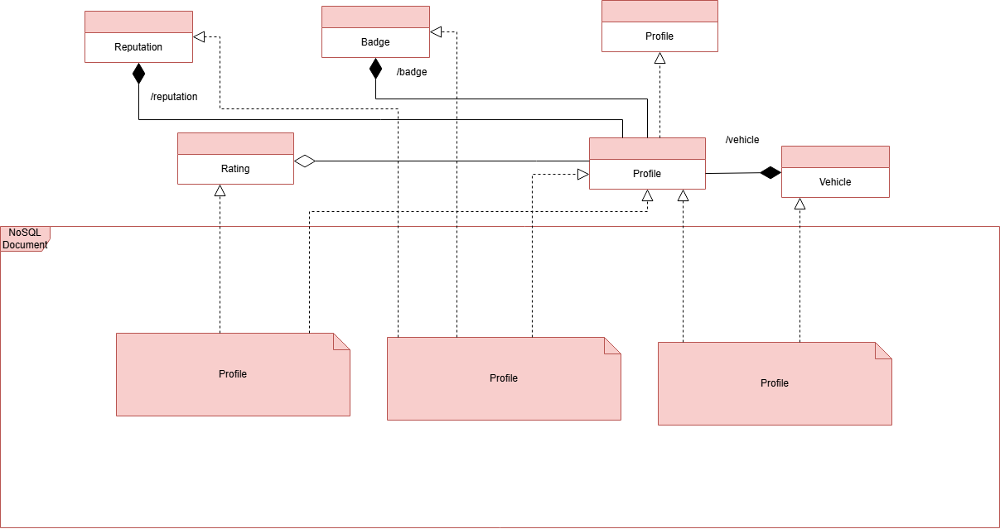


### 🧩 Sequence Diagrams
---
This diagram presents the complete CRUD workflow for profile & reputation. It includes sequence diagrams for creating, updating, deleting and anothers functionalities diagrams like the use cases 

This sequence diagram illustrates the flow of a "Calculate User Average" operation within a software application that likely follows Clean Architecture or Hexagonal Architecture principles. It shows how a request propagates through the Controller, Port, Use Case, Adapter, and Repository layers.

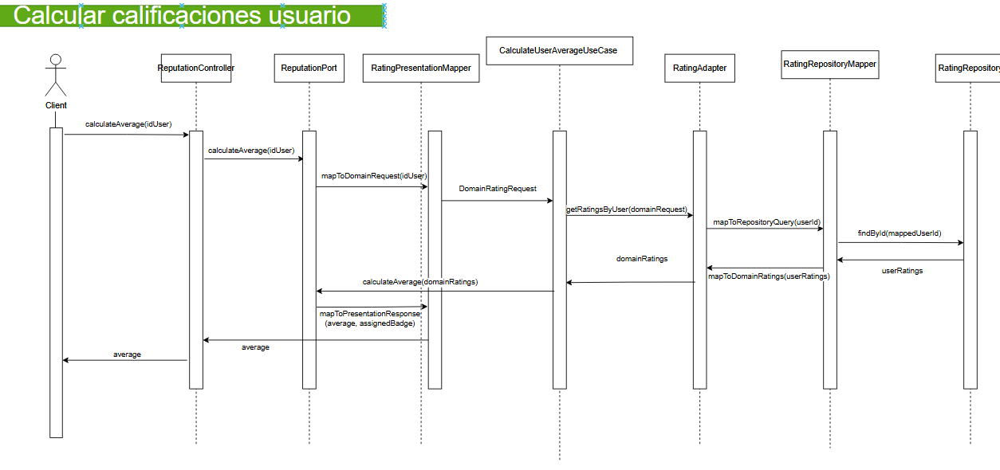
---

This diagram outlines the process of assigning a specific "badge" or "distinctive" (e.g., "Top Driver," "Frequent Passenger") to a user based on their history. It follows the same Clean Architecture pattern as the previous diagram, separating concerns into Controllers, Ports, Mappers, Use Cases, and Repositories.

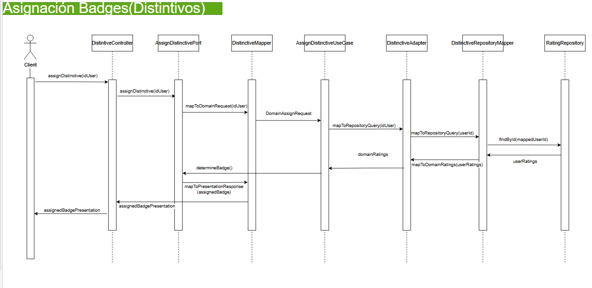
---

This diagram details the flow for a user (Client) submitting a rating and comment for a completed trip (Travel). It strictly follows the Clean Architecture layering.

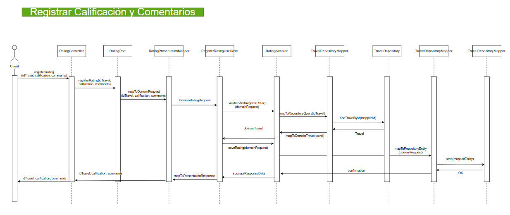
---

The driver Profile Creation sequence diagram illustrates the workflow for registering a new driver within a Clean Architecture framework, beginning when the Client sends a createDriverProfile request to the ProfileController, which forwards it to the ProfilePort. The port utilizes the ProfileMapper to transform the raw input into a DomainProfileRequest for the CreateDriverUseCase, which handles the business logic and delegates persistence to the ProfileAdapter; the adapter then coordinates with the ProfileRepositoryMapper to save the profile in the ProfileRepository, after which the resulting data is mapped back through the layers and formatted by the ProfileMapper into a response returned to the Client.

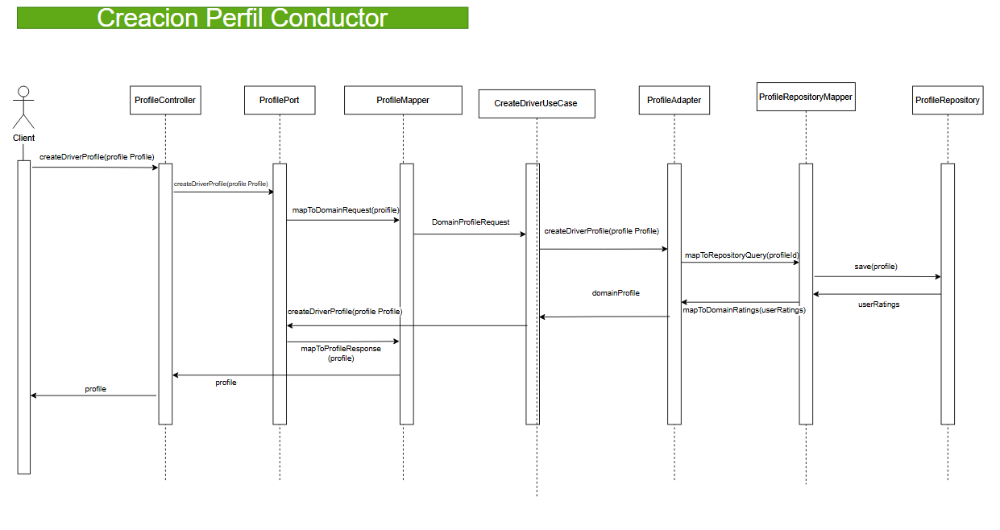
---

The passenger Profile Creation sequence diagram illustrates the workflow for registering a new passenger within a Clean Architecture framework, beginning when the Client sends a createPassengerProfile request to the ProfileController, which forwards it to the ProfilePort. The port utilizes the ProfileMapper to transform the raw input into a DomainProfileRequest for the CreatePassengerUseCase, which handles the business logic and delegates persistence to the ProfileAdapter; the adapter then coordinates with the ProfileRepositoryMapper to save the profile in the ProfileRepository, after which the resulting data is mapped back through the layers and formatted by the ProfileMapper into a response returned to the Client.

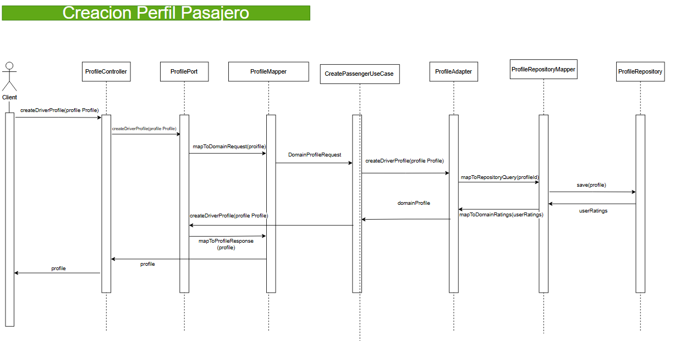
---

The companiant Profile Creation sequence diagram illustrates the workflow for registering a new companiant within a Clean Architecture framework, beginning when the Client sends a createCompaniantProfile request to the ProfileController, which forwards it to the ProfilePort. The port utilizes the ProfileMapper to transform the raw input into a DomainProfileRequest for the CreateCompaniantUseCase, which handles the business logic and delegates persistence to the ProfileAdapter; the adapter then coordinates with the ProfileRepositoryMapper to save the profile in the ProfileRepository, after which the resulting data is mapped back through the layers and formatted by the ProfileMapper into a response returned to the Client.

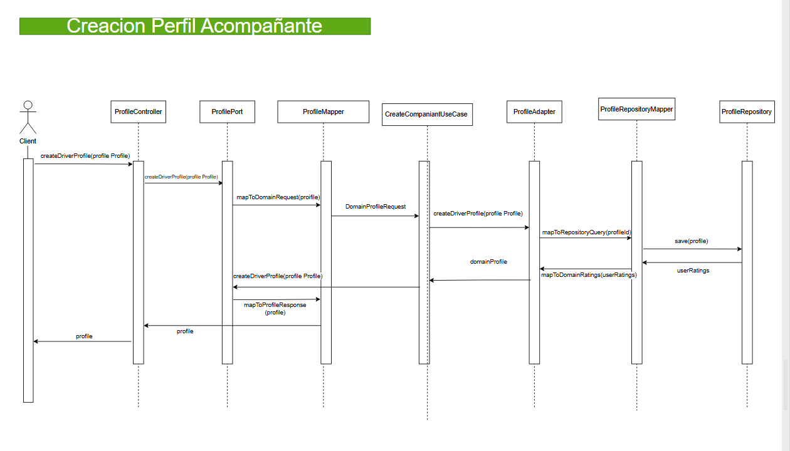


### 🧩 Specific Deploy Diagram
---
This diagram illustrates the cloud deployment architecture and workflow of the profiles and reputacion module


# 🧪 Testing

Testing is a essential part of the project functionability, this part will show the code coverage and code quality analazing with tools like JaCoCo and SonarQube.

### 📊 Code Coverage Jacoco
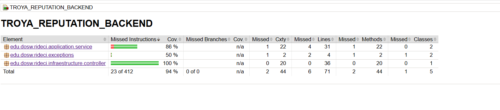

### Swagger


---

### 🔍 Static Analysis (SonarQube)


# 🚀 Getting Started

This section guides you through setting ip the project locally. This project requires **Java 17**. If you have a different version, you can change it or we recommend using **Docker** to ensure compatibility before compile.

### Clone & open repository

``` bash
git clone https://github.com/RIDECI/TROYA_REPUTATION_BACKEND.git
```

``` bash
cd TROYA_REPUTATION_BACKEND
```

You can open it on your favorite IDE

### Dockerize the project

Dockerize before compile the project avoid configuration issues and ensure environment consistency.

``` bash
docker compose up -d
```

### Install dependencies & compile project

Download dependencies and compile the source code.

``` bash
mvn clean install
```

``` bash
mvn clean compile
```

### To run the project
Start the Spring Boot server

``` bash
mvn spring-boot:run
```
